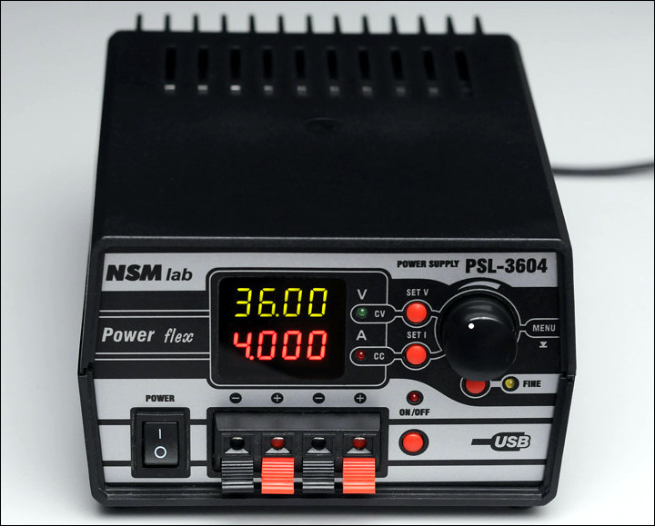

## PSL-3604

### Description
Laboratory power supply 36V, 4A

### Links
- [http://www.leoniv.diod.club/projects/power/psl-3604/psl-3604.html](http://www.leoniv.diod.club/projects/power/psl-3604/psl-3604.html)

### Authors
- Shematic, pcb, device design - [Leonid Ivanovich aka Liv](http://www.leoniv.diod.club/contacts/contacts.html)

### Buy parts for assembling
For assembly, you need 3 printed circuit boards:
  - Power pcb - [Order PCB from PCBWay](https://www.pcbway.com/project/shareproject/psl_3604_pow.html)
  - Panel pcb - [Order PCB from PCBWay](https://www.pcbway.com/project/shareproject/psl_3604_pan_2.html)
  - Out pcb - [Order PCB from PCBWay](https://www.pcbway.com/project/shareproject/psl_3604_out_2.html)

### Folder structure
Most folder names are self explanatory.
- 3d - contains 3d models of PCB
- bom - contains the bill of materials
- docs - contains drawings and images outputs of schematic and PCB files, assembling manuals
- firmware - contains compiled binary files
- gerbers - contains zip file of the PCB Gerbers and drill drawings for manufacture
- images - contain photo of assembling prototype
- pcb - contains the original schematic and PCB design files (Altium Designer,  KiCAD, SprintLayout, etc)
- soft - contains custom software using, for example, for operate with this device 
- source - contains project souce code (sketchs for Arduino, files C/C++, etc)
- transformers - contains spec for transformers, coils, etc